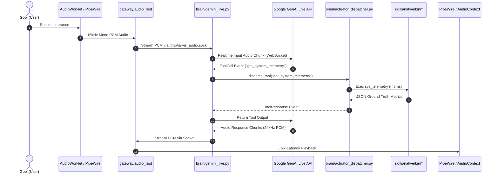
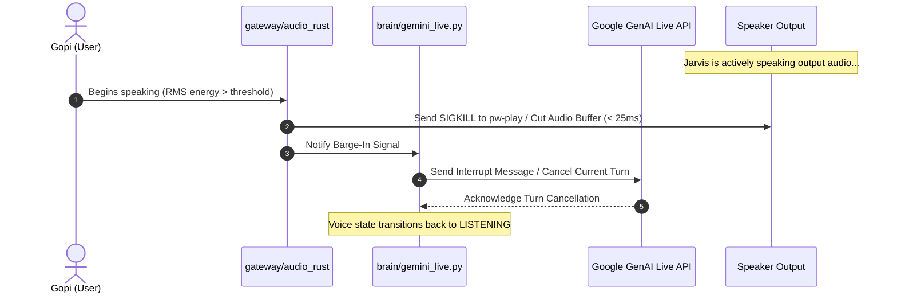
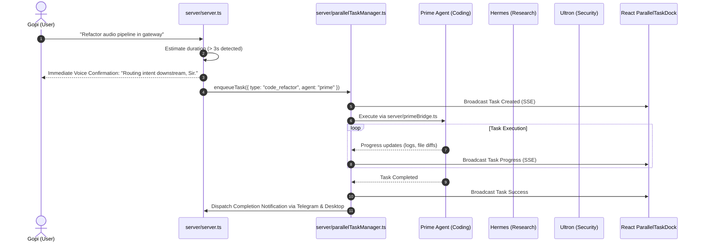

# J.A.R.V.I.S. OS — Comprehensive Codebase Reference & Architecture Manual

> **Status**: Production Reference Manual  
> **Target Environment**: Arch Linux x86_64 | Omarchy 4.0.3 | Hyprland (Wayland) | PipeWire 1.6.8  
> **Hardware Node**: Intel Core i5-1235U (10 Cores: 2P + 8E, 12 Threads) | 16 GB Virtual Memory (7.4 GiB RAM + 7.4 GiB zram)  
> **Primary Repository**: [`/home/g0pi/Projects/Jarvis-OS`](file:///home/g0pi/Projects/Jarvis-OS)  
> **Knowledge Graph MCP**: [`codebase-memory-mcp`](file:///home/g0pi/.local/bin/codebase-memory-mcp) (v0.11.0)  

---

## 1. System Overview & Core Operational Laws

J.A.R.V.I.S. OS is a sovereign, voice-first, autonomous AI operating system that directly interfaces with the Linux kernel, Wayland compositor (`Hyprland`), and PipeWire audio subsystem. It eliminates cloud latency and heavy wrapper overhead through native C++17 workers, real-time Gemini Live WebSocket audio, zero-GC Rust audio streaming, an Axum/SQLite universal memory engine, and a multi-agent corporate execution matrix.

### Inviolable Operational Laws

1. **Sub-50ms Instant Barge-In Interruption**:
   - When the user begins speaking while J.A.R.V.I.S. is speaking, audio playback must terminate in **< 25 ms**.
   - Handled via RMS energy detection in the audio pipeline and immediate signal killing of the active playback process (`pw-play` / AudioContext pause).
2. **Sub-3-Second Flash Execution (Local Actuation)**:
   - Everyday OS actions (window management, volume, brightness, workspace switching, process monitoring, thermal audits) execute directly through native compiled C++17 binaries in **< 5 ms** without LLM round-trip delay.
3. **The 3-Second Hand-Off Protocol (Background Delegation)**:
   - Actions taking $\le$ 3 seconds run synchronously in-process.
   - Actions taking > 3 seconds (coding, deep research, compilation) trigger an immediate spoken confirmation (*"Routing intent downstream, Sir."*), serialize task parameters to [`/tmp/jarvis_ipc.sock`](file:///tmp/jarvis_ipc.sock), transition voice to standby, and dispatch to background agents (**Prime**, **Hermes**, **Ultron**).
4. **Anti-Stale Data Law**:
   - Real-time or volatile metrics (weather, crypto, system thermals, network state) must never be answered from static LLM weights. Real-time queries must invoke parallel Google Search grounding or native C++ telemetry workers.
5. **Asymmetric Core Affinity & Memory Safeguards**:
   - Performance Cores (0–1) are reserved for interactive desktop, Hyprland, and real-time audio.
   - Efficient Cores (2–9) run Docker sandboxes and background agents.
   - Daemon memory footprint must remain strictly **< 200 MB RAM** with **zero local LLM weights loaded into physical RAM**.
6. **Python Core Primacy & Zero-Duplication Law**:
   - **Python 3.12+** (`brain/`, `main.py`) is the primary core language of J.A.R.V.I.S. OS. All intelligence, Gemini Live sessions, tool execution, actuator dispatching, subagent bridges (**Hermes**, **Ultron**, **Prime**), memory vault management, 24/7 gateway, and background tasks are written and run exclusively in Python.
   - **TypeScript & React 19** (`ui/web/src/`) are strictly and exclusively for presenting to the UI design (visual interface, Web Audio API capture, audio visualizer, UI cards, modals, themes).
   - Zero duplicate execution logic across Python and TypeScript. Backend logic lives in Python only.
   - **Execution Parity**: `python3 main.py` and `npm run dev` produce the exact same operational output and launch the same unified stack.

---

## 2. High-Level Architecture & Component Map

```
                               ┌────────────────────────────────────────────────────────┐
                               │                    USER / OPERATOR                     │
                               └──────────────────────────┬─────────────────────────────┘
                                                          │
                    ┌─────────────────────────────────────┴─────────────────────────────────────┐
                    ▼                                                                           ▼
       ┌─────────────────────────┐                                                 ┌─────────────────────────┐
       │   React 19 Web UI       │                                                 │    Wayland HUD Shell    │
       │   TypeScript (Presentation)                                                │   Zero-Dep Native HUD   │
       │   [ui/web/]                 │                                                 │   [ui/hud/]             │
       └────────────┬────────────┘                                                 └────────────┬────────────┘
                    │ WebSocket & REST API (Port 8000)                                          │
                    └─────────────────────────────────────┬─────────────────────────────────────┘
                                                          ▼
                               ┌────────────────────────────────────────────────────────┐
                               │                  PYTHON BRAIN CORE                     │
                               │         PRIMARY CORE ENGINE (Port 8000)                │
                               │               [brain/] & [main.py]                     │
                               ├────────────────────────────────────────────────────────┤
                               │ • FastAPI Server & Static UI Serve (dist/)             │
                               │ • Gemini Live WebSocket Session (Bi-directional)       │
                               │ • ActuatorDispatcher (74 Native Tools & Custom Tools)  │
                               │ • PromptEngine (Jinja2 Persona Rendering)              │
                               │ • SecurityGuard (Command Whitelist & AST Auditor)      │
                               │ • ForgeSandbox (bwrap Sandboxed Capability Creator)    │
                               │ • AudioBridge (/tmp/jarvis_audio.sock Unix Bridge)     │
                               │ • MemoryEngine & Vault Manager [memory/vault/]         │
                               │ • Sub-Agent Bridges:                                   │
                               │     - HermesBridge (Headless hermes chat & vault)      │
                               │     - UltronBridge (Gateway HTTP :18789 & CLI)         │
                               │     - PrimeBridge (Prime coding agent)                 │
                               │ • Heartbeat & Autonomous 24/7 Gateway Daemon           │
                               └───────────┬────────────────────────────┬───────────────┘
                                            │                            │
                     ┌──────────────────────┘                            └──────────────────────┐
                     ▼                                                                          ▼
┌───────────────────────────────────────────────────────┐                 ┌───────────────────────────────────────────────────────┐
│            NATIVE C++17 ACTUATION SUITE               │                 │              UNIVERSAL MEMORY ENGINE                  │
│                   [skills/native/]                    │                 │                Port 50051 (Axum + WAL)                │
├───────────────────────────────────────────────────────┤                 │                  [memory/engine/]                     │
│ 18 Compiled Native Binaries:                          │                 ├───────────────────────────────────────────────────────┤
│ • sys_telemetry     • pc_spec       • thermal_scan    │                 │ • DatabasePool (SQLite WAL Connection Pool)           │
│ • hardware_ctrl     • media_ctrl    • desktop_control │                 │ • FTS5 Search & Vector Similarity Ranker              │
│ • open_app          • process_ctrl  • service_ctrl    │                 │ • TreeEngine & CascadeSealer (Hierarchical Context)   │
│ • storage_scan      • net_inspector • wifi_scan       │                 │ • Archivist, DecayWorker, GitWatcher, TranscriptMiner │
│ • firewall_audit    • vision_ctrl   • file_search     │                 │ • SecretScanner & VaultWriter                         │
│ • jarvis_sysctl     • memory_tester • omarchy_ctrl    │                 │ • Python SDK & Vault Bridge [memory/python/]          │
└───────────────────────────────────────────────────────┘                 └───────────────────────────────────────────────────────┘
                                ▲                                                                     ▲
                                │                                                                     │
                                └───────────────────────────────────┬─────────────────────────────────┘
                                                                    │
                                   ┌────────────────────────────────┴────────────────────────────────┐
                                   ▼                                                                 ▼
                      ┌─────────────────────────┐                                       ┌─────────────────────────┐
                      │    RUST AUDIO GATEWAY   │                                       │   TELEGRAM CHANNEL DAEMON│
                      │  /tmp/jarvis_audio.sock │                                       │    24/7 Channel Bridge  │
                      │  [gateway/audio_rust/]  │                                       │    [gateway/telegram/]  │
                      └─────────────────────────┘                                       └─────────────────────────┘
```

---

## 3. Directory Layout & Subsystem Breakdown

### 3.1. Project Root Directory

| Path | Description |
| :--- | :--- |
| [`main.py`](file:///home/g0pi/Projects/Jarvis-OS/main.py) | Master Python launcher. Validates venv, ensures `jarvis-gateway.service` is active, spawns Rust audio gateway, and boots `brain.main`. |
| [`package.json`](file:///home/g0pi/Projects/Jarvis-OS/package.json) | Node.js project manifest. Defines build scripts (`build:native`, `build:cpp`, `build:memory`, `build:gateway`, `dev`, `core`). |
| [`agents.registry.json`](file:///home/g0pi/Projects/Jarvis-OS/agents.registry.json) | Ground-truth catalog of verified Agents (`jarvis-prime`, `prime-agent`, `hermes`, `ultron`), modular skills, and native tools. |
| [`metadata.json`](file:///home/g0pi/Projects/Jarvis-OS/metadata.json) | Hardware permissions and platform capability metadata. |
| [`vite.config.ts`](file:///home/g0pi/Projects/Jarvis-OS/vite.config.ts) | Vite bundler configuration for the React web application. |

---

### 3.2. Brain Core Subsystem (`brain/`)

The Python Core Engine handles real-time Gemini Live WebSocket sessions, audio/vision ingestion, prompt rendering, dynamic tool auditing, capability forging, and security policies.

* **[`brain/server.py`](file:///home/g0pi/Projects/Jarvis-OS/brain/server.py)**:
  - FastAPI HTTP and WebSocket application.
  - Endpoints:
    - `POST /api/chat/flash`: One-off text turn using Gemini 3.7 Flash.
    - `POST /api/chat/tts`: Generates speech audio for conversational responses.
    - `POST /api/chat/greet`: Time-of-day contextual welcome greeting.
    - `GET /api/system/telemetry`: Hardware metrics Ground Truth via C++ workers.
    - `GET /api/system/processes`: Process lists and memory utilization.
    - `POST /api/system/processes/kill`: Secure termination of target PID.
    - `GET /api/system/apps`: Installed desktop applications catalog.
    - `POST /api/system/control`: Low-level system volume, brightness, and audio healing.
    - `POST /api/system/exec`: Whitelisted command execution via `SecurityGuard`.
    - `POST /api/webrtc/offer`, `/api/webrtc/ice`, `/api/webrtc/command`: Low-latency WebRTC streams.
    - `WebSocket /ws/live`: Real-time bi-directional audio/video bridge to Gemini Live.
* **[`brain/gemini_live.py`](file:///home/g0pi/Projects/Jarvis-OS/brain/gemini_live.py)**:
  - `GeminiLiveSession`: Manages persistent asynchronous connection to Google GenAI Live API (`gemini-3.1-flash-live-preview`).
  - Handles client content chunks, realtime input streaming (PCM 16kHz audio, JPEG frames), server turn completion, tool call reception, and tool response delivery.
* **[`brain/actuator_dispatcher.py`](file:///home/g0pi/Projects/Jarvis-OS/brain/actuator_dispatcher.py)**:
  - `ActuatorDispatcher`: Master tool execution engine.
  - Dispatches tool invocations from Gemini Live or REST callers to:
    1. Native compiled C++ workers (`skills/native/bin/`).
    2. Desktop environment actions (`skills/omarchy/`).
    3. Codebase intelligence commands via `codebase-memory-mcp` CLI (`_handle_codebase_tool`).
    4. Capability Forge sandboxed tools (`_handle_forge_tool`).
    5. Background long-running tasks (`start_background_task`).
* **[`brain/prompt_engine.py`](file:///home/g0pi/Projects/Jarvis-OS/brain/prompt_engine.py)**:
  - `PromptEngine`: Renders Jinja2 system prompt templates (`brain/templates/system_prompt.j2` and `brain/templates/system_prompt_hermes.j2`).
  - Injects dynamic OS status, verified skills list, memory context, and active persona rules.
* **[`brain/security.py`](file:///home/g0pi/Projects/Jarvis-OS/brain/security.py)**:
  - `SecurityGuard`: Validates shell execution requests against strict allowlists/blocklists. Redacts API tokens, private keys, and passwords.
* **[`brain/forge_sandbox.py`](file:///home/g0pi/Projects/Jarvis-OS/brain/forge_sandbox.py)** & **[`brain/tool_ast_auditor.py`](file:///home/g0pi/Projects/Jarvis-OS/brain/tool_ast_auditor.py)**:
  - Dynamic tool creation engine. Uses Bubblewrap (`bwrap`) to run generated tools in isolated filesystem containers and audits Python AST nodes to block malicious imports (`os.system`, socket exfiltration).
* **[`brain/audio_bridge.py`](file:///home/g0pi/Projects/Jarvis-OS/brain/audio_bridge.py)**:
  - Unix Domain Socket server (`/tmp/jarvis_audio.sock`) connecting the Rust audio engine to Python.
* **[`brain/hud.py`](file:///home/g0pi/Projects/Jarvis-OS/brain/hud.py)**:
  - Launcher for the native HUD interface.
* **[`brain/voice/`](file:///home/g0pi/Projects/Jarvis-OS/brain/voice/)**:
  - `fft_telemetry.py`: Real-time fast Fourier transform audio spectrum analysis.
  - `vad_config.py`: Voice Activity Detection thresholds and speech energy configurations.
  - `ipc_tool_sink.py`: IPC telemetry and tool execution event sink.

---

### 3.3. Node.js & TypeScript Server Subsystem (`server/`)

The TypeScript server provides the primary application gateway, orchestrating agent bridges, background tasks, and desktop integrations.

* **[`server/server.ts`](file:///home/g0pi/Projects/Jarvis-OS/server/server.ts)**:
  - Main entry point on port 3000.
  - Hosts Vite development middleware or serves static built assets from `dist/`.
  - Exposes REST endpoints for:
    - Multi-Tier LLM Chat (`/api/chat`, `/api/chat/tts`, `/api/chat/flash`).
    - Agent Bridges (`/api/prime/*`, `/api/hermes/*`, `/api/ultron/*`, `/api/openclaw/*`).
    - System Management (`/api/system/*`).
    - Task Management (`/api/tasks`, `/api/tasks/run`, `/api/tasks/:id/cancel`).
    - Skills Hub (`/api/skills`, `/api/skills/execute`, `/api/skills/omarchy`).
    - Registry (`/api/registry/agents`, `/api/registry/skills`, `/api/registry/tools`).
* **[`server/system_controller.ts`](file:///home/g0pi/Projects/Jarvis-OS/server/system_controller.ts)**:
  - Direct bridge between Node.js and compiled C++17 binaries.
  - Core function `callCppWorker(binaryName, args)` executes compiled binaries in `skills/native/bin/` with sub-5ms latency.
* **[`server/parallelTaskManager.ts`](file:///home/g0pi/Projects/Jarvis-OS/server/parallelTaskManager.ts)**:
  - `ParallelTaskManager`: Asynchronous background task scheduler.
  - Tracks task progress, routes long-running work to `Prime`, `Hermes`, or `Ultron`, and pushes real-time status events via Server-Sent Events (SSE) or WebSocket.
* **[`server/heartbeat.ts`](file:///home/g0pi/Projects/Jarvis-OS/server/heartbeat.ts)**:
  - Autonomous 24/7 background heartbeat daemon.
  - Evaluates system health every 30 minutes, runs scheduled morning daily digests, and dispatches proactive notifications.
* **[`server/primeBridge.ts`](file:///home/g0pi/Projects/Jarvis-OS/server/primeBridge.ts)**:
  - Bridge to `Prime Agent` (`PrimeIntellect-ai/prime-agent`), specializing in fullstack software engineering, debugging, and AST refactoring.
* **[`server/hermesBridge.ts`](file:///home/g0pi/Projects/Jarvis-OS/server/hermesBridge.ts)**:
  - Bridge to `Hermes Intelligence Agent`. Interfaces with the local Obsidian knowledge vault (`jarvis-memory/`) and executes autonomous CLI research tasks.
* **[`server/ultronBridge.ts`](file:///home/g0pi/Projects/Jarvis-OS/server/ultronBridge.ts)**:
  - Bridge to `Ultron Autonomous Sentinel` (port 18789). Performs zero-trust security audits, Linux hardware optimization, and self-healing.
* **[`server/openclawBridge.ts`](file:///home/g0pi/Projects/Jarvis-OS/server/openclawBridge.ts)**:
  - Bridge to OpenClaw multi-agent framework.
* **[`server/skills.ts`](file:///home/g0pi/Projects/Jarvis-OS/server/skills.ts)**:
  - Registry and dispatch logic for built-in modular skills (`get_weather_forecast`, `get_news_headlines`, `manage_reminders`, `manage_schedules`, `calculate_expression`, `control_system_action`).
* **[`server/telegramBot.ts`](file:///home/g0pi/Projects/Jarvis-OS/server/telegramBot.ts)** & **[`server/telegramNotifier.ts`](file:///home/g0pi/Projects/Jarvis-OS/server/telegramNotifier.ts)**:
  - Inbound and outbound Telegram bot message parsing and dispatch.

---

### 3.4. Universal Memory Engine (`memory/`)

The memory engine implements a dual-tier cognitive store combining persistent SQLite WAL storage, FTS5 full-text indexing, vector search, hierarchical context tree buffers, and automatic memory decay.

#### 1. Rust Engine Core (`memory/engine/`)
* **[`memory/engine/src/main.rs`](file:///home/g0pi/Projects/Jarvis-OS/memory/engine/src/main.rs)**: CLI and daemon runner. Supports commands `init`, `inspect`, `test`, `serve` (Axum server on port 50051), and `mcp` (stdio MCP server).
* **[`memory/engine/src/db/connection.rs`](file:///home/g0pi/Projects/Jarvis-OS/memory/engine/src/db/connection.rs)**: `DatabasePool` managing multi-threaded SQLite connections with WAL journal mode.
* **[`memory/engine/src/repository/`](file:///home/g0pi/Projects/Jarvis-OS/memory/engine/src/repository/)**:
  - `NodeRepository`: CRUD operations for memory nodes (`MemoryNode`), tiers (`ephemeral`, `working`, `vault`), and decay levels.
  - `EdgeRepository`: Relationship graph storage (`CALLS`, `INHERITS`, `DEPENDS_ON`, `SEMANTICALLY_RELATED`).
  - `ConversationRepository`: Conversational turn histories.
  - `DiaryRepository`: Daily logs and historical memory summaries.
  - `KnowledgeTripleRepository`: Semantic triples `(subject, predicate, object)`.
* **[`memory/engine/src/tree/`](file:///home/g0pi/Projects/Jarvis-OS/memory/engine/src/tree/)**:
  - `TreeBuffer` & `TreeBufferRepository`: Working memory staging buffer.
  - `TreeFlusher` & `CascadeSealer`: Compaction of working buffers into long-term hierarchical summaries.
  - `TreeRetrieval`: Context drill-down for deep relevance matching.
* **[`memory/engine/src/search/`](file:///home/g0pi/Projects/Jarvis-OS/memory/engine/src/search/)**:
  - `Fts5SearchEngine`: BM25 SQLite full-text search.
  - `VectorSearchEngine`: High-dimensional embedding distance ranking.
  - `HybridRanker`: Combines FTS5, vector similarity, and recency scoring.
* **[`memory/engine/src/workers/`](file:///home/g0pi/Projects/Jarvis-OS/memory/engine/src/workers/)**:
  - `Archivist`: Long-term memory consolidation.
  - `DecayWorker`: Ebbinghaus forgetting curve memory decay.
  - `GitWatcher`: Tracks file modifications across indexed repositories.
  - `TranscriptMiner`: Extracts facts, entities, and preferences from session logs.

#### 2. Python Bridge (`memory/python/`)
* **[`memory/python/engine.py`](file:///home/g0pi/Projects/Jarvis-OS/memory/python/engine.py)**: `MemoryEngine` class providing direct SQLite queries for Python services.
* **[`memory/python/vault.py`](file:///home/g0pi/Projects/Jarvis-OS/memory/python/vault.py)**: `VaultManager` synchronizing structured memory nodes into Markdown files with YAML frontmatter.
* **[`memory/python/hermes_bridge.py`](file:///home/g0pi/Projects/Jarvis-OS/memory/python/hermes_bridge.py)**: Formats and injects relevant memory contexts into Hermes prompts.

---

### 3.5. Native C++17 Actuation Suite (`skills/native/`)

18 compiled C++17 binaries located in `skills/native/src/` compile to `skills/native/bin/` via `skills/native/Makefile`. They execute OS-level operations with sub-5ms latency:

| Binary Name | Source File | Purpose & Capabilities |
| :--- | :--- | :--- |
| `sys_telemetry` | [`sys_telemetry.cpp`](file:///home/g0pi/Projects/Jarvis-OS/skills/native/src/sys_telemetry.cpp) | Real-time CPU usage, RAM utilization, swap, and uptime ground truth. |
| `pc_spec` | [`pc_spec.cpp`](file:///home/g0pi/Projects/Jarvis-OS/skills/native/src/pc_spec.cpp) | Comprehensive hardware audit (CPU, GPU, DMI, BIOS, RAM layout, storage). |
| `thermal_scan` | [`thermal_scan.cpp`](file:///home/g0pi/Projects/Jarvis-OS/skills/native/src/thermal_scan.cpp) | Direct kernel thermal zone and cooling sensor reader. |
| `hardware_ctrl` | [`hardware_ctrl.cpp`](file:///home/g0pi/Projects/Jarvis-OS/skills/native/src/hardware_ctrl.cpp) | Sound server diagnostics, PipeWire recovery, brightness, and battery queries. |
| `media_ctrl` | [`media_ctrl.cpp`](file:///home/g0pi/Projects/Jarvis-OS/skills/native/src/media_ctrl.cpp) | MPRIS2 media controller (play, pause, next, volume via DBus). |
| `desktop_control` | [`desktop_control.cpp`](file:///home/g0pi/Projects/Jarvis-OS/skills/native/src/desktop_control.cpp) | Hyprland compositor control (workspace change, window focus, tiling, screenshots). |
| `open_app` | [`open_app.cpp`](file:///home/g0pi/Projects/Jarvis-OS/skills/native/src/open_app.cpp) | Launches desktop apps via `.desktop` XDG entries with environment isolation. |
| `process_ctrl` | [`process_ctrl.cpp`](file:///home/g0pi/Projects/Jarvis-OS/skills/native/src/process_ctrl.cpp) | Reads `/proc` for top memory/CPU processes, terminates PIDs safely. |
| `service_ctrl` | [`service_ctrl.cpp`](file:///home/g0pi/Projects/Jarvis-OS/skills/native/src/service_ctrl.cpp) | Systemd user and system service lifecycle control (status, restart, stop). |
| `storage_scan` | [`storage_scan.cpp`](file:///home/g0pi/Projects/Jarvis-OS/skills/native/src/storage_scan.cpp) | Partition mount points, filesystem usage, and disk health metrics. |
| `net_inspector` | [`net_inspector.cpp`](file:///home/g0pi/Projects/Jarvis-OS/skills/native/src/net_inspector.cpp) | Active network interfaces, IP addresses, listening ports, and socket connections. |
| `wifi_scan` | [`wifi_scan.cpp`](file:///home/g0pi/Projects/Jarvis-OS/skills/native/src/wifi_scan.cpp) | Wireless adapter scan, SSID discovery, signal strengths via `nl80211`. |
| `firewall_audit` | [`firewall_audit.cpp`](file:///home/g0pi/Projects/Jarvis-OS/skills/native/src/firewall_audit.cpp) | `nftables` / `iptables` ruleset and open port security verification. |
| `vision_ctrl` | [`vision_ctrl.cpp`](file:///home/g0pi/Projects/Jarvis-OS/skills/native/src/vision_ctrl.cpp) | Intel VA-API hardware-accelerated screen grab and webcam frame acquisition. |
| `file_search` | [`file_search.cpp`](file:///home/g0pi/Projects/Jarvis-OS/skills/native/src/file_search.cpp) | Multi-threaded filesystem grep and filename pattern matching. |
| `jarvis_sysctl` | [`jarvis_sysctl.cpp`](file:///home/g0pi/Projects/Jarvis-OS/skills/native/src/jarvis_sysctl.cpp) | Kernel sysctl runtime tuning (zram aggressiveness, cache pressure). |
| `memory_tester` | [`memory_tester.cpp`](file:///home/g0pi/Projects/Jarvis-OS/skills/native/src/memory_tester.cpp) | Physical memory stress-testing and allocation verification. |
| `omarchy_ctrl` | [`omarchy_ctrl.cpp`](file:///home/g0pi/Projects/Jarvis-OS/skills/native/src/omarchy_ctrl.cpp) | Arch Linux / Omarchy desktop environment specific automation. |

---

### 3.6. User Interfaces (`ui/`)

#### 1. React 19 Web Interface (`ui/web/`)
Built with React 19, TypeScript, Vite 6, and Tailwind CSS v4.
- **[`ui/web/src/App.tsx`](file:///home/g0pi/Projects/Jarvis-OS/ui/web/src/App.tsx)**: Main UI shell. Handles layout, modal overlays, connection states, and message streams.
- **[`ui/web/src/hooks/useVoiceControls.ts`](file:///home/g0pi/Projects/Jarvis-OS/ui/web/src/hooks/useVoiceControls.ts)**: State machine orchestrating audio capture, WebSockets, barge-in detection, and processing tiers.
- **[`ui/web/src/utils/audioStreamer.ts`](file:///home/g0pi/Projects/Jarvis-OS/ui/web/src/utils/audioStreamer.ts)**: Web Audio API pipeline. Decodes and plays raw PCM chunks smoothly with jitter buffering.
- **[`ui/web/public/pcm-capture-processor.js`](file:///home/g0pi/Projects/Jarvis-OS/ui/web/public/pcm-capture-processor.js)**: `AudioWorkletProcessor` capturing 16kHz mono PCM directly from microphone.
- **Key UI Components**:
  - `ParallelTaskDock.tsx`: Floating dock showing background tasks dispatched to Prime, Hermes, or Ultron.
  - `SkillDisplayCard.tsx`: Dynamic interactive cards for weather, news, reminders, and agent outputs.
  - `VoiceVisualizer.tsx`: Waveform and halo visualizer showing speech states.
  - `LiveVisionPreview.tsx`: Live camera or screen share feed for multimodal analysis.
  - `ThinkingMetrics.tsx`: Latency metrics and thinking step telemetry.
  - `MultiInputBar.tsx`: Unified input bar supporting voice, typed text, file attachments, and folders.
  - `RemindersDrawer.tsx` & `SkillsHubModal.tsx`: Management drawers for active tasks and skills.

#### 2. Native Wayland HUD Overlay (`ui/hud/`)
Zero-dependency, browser-independent HUD interface for Hyprland/Wayland.
- Uses Web Speech API, CSS design tokens (`tokens.css`, `orb.css`), and canvas frequency visualization.
- Launchable via `python ui/hud/run.py` or directly through Chrome/Edge.

---

## 4. Inter-Process Communication & Network Topology

| Port / Path | Protocol | Component | Role |
| :--- | :--- | :--- | :--- |
| **3000** | HTTP / WS | Node Gateway (`server/server.ts`) | Main application gateway, Web UI server, and agent orchestration. |
| **8000** | HTTP / WS | Python Brain (`brain/server.py`) | Realtime Gemini Live sessions, WebRTC signaling, tool dispatch. |
| **50051** | HTTP / WS | Rust Memory (`memory/engine/`) | Universal Memory Engine Axum API and WebSocket event bus. |
| **9749** | HTTP | CBM Visualizer (`codebase-memory-mcp`) | 3D knowledge graph visualizer and interactive exploration UI. |
| **18789** | HTTP / REST | Ultron Sentinel Gateway | Zero-trust security sentinel and autonomous agent gateway. |
| **20128** | HTTP / REST | Local Model Proxy | Local LLM fallback provider endpoint. |
| `/tmp/jarvis_audio.sock` | Unix Stream | Rust Audio Gateway | Zero-copy PCM audio transfer between PipeWire and Python Core. |
| `/tmp/jarvis_ipc.sock` | Unix Stream | Orchestrator IPC Bus | Structured JSON event exchange between Brain, Server, and Background Daemons. |

---

## 5. Comprehensive API & Route Index

### Node.js Gateway API (`server/server.ts` — Port 3000)

| Method & Route | Description |
| :--- | :--- |
| `GET /api/health` | Overall system health, active agent status, and uptime. |
| `POST /api/chat` | Multi-turn conversational chat with automatic tier selection. |
| `POST /api/chat/flash` | Ultra-low-latency single-turn query using Gemini 3.7 Flash. |
| `POST /api/chat/tts` | Synthesizes speech audio for client playback. |
| `POST /api/chat/greet` | Context-aware greeting message based on local time and state. |
| `GET /api/prime/health` | Health check for Prime Coding Agent. |
| `POST /api/prime/chat` | Dispatches coding/refactoring prompt to Prime Agent. |
| `GET /api/hermes/health` | Health check for Hermes CLI and Obsidian vault. |
| `POST /api/hermes/chat` | Dispatches deep research query to Hermes agent. |
| `GET /api/ultron/health` | Health check for Ultron security gateway. |
| `POST /api/ultron/execute` | Runs Ultron system boost, deep audit, or security scan. |
| `GET /api/openclaw/health` | Health check for OpenClaw gateway. |
| `POST /api/openclaw/chat` | Dispatches task to OpenClaw multi-agent bridge. |
| `GET /api/tasks` | Returns active, completed, and failed background tasks. |
| `POST /api/tasks/run` | Initiates asynchronous background task with streaming progress. |
| `POST /api/tasks/:id/cancel` | Cancels running background task. |
| `GET /api/skills` | Returns catalog of registered skills and execution modes. |
| `POST /api/skills/execute` | Executes skill by name with supplied parameters. |
| `GET /api/system/hardware` | Hardware Ground Truth via `pc_spec` C++ worker. |
| `GET /api/system/telemetry` | Dynamic CPU, RAM, and load metrics via `sys_telemetry`. |
| `GET /api/system/thermals` | Kernel temperature sensors via `thermal_scan`. |
| `GET /api/system/storage` | Mounts and disk utilization via `storage_scan`. |
| `GET /api/system/processes` | Process tree via `process_ctrl`. |
| `POST /api/system/processes/kill` | Kills process by PID via `process_ctrl`. |
| `POST /api/system/control` | Adjusts volume, brightness, or executes audio healing. |
| `GET /api/reminders` | Retrieves scheduled tasks and alarms from memory. |
| `POST /api/reminders` | Schedules new reminder with cron expression. |
| `GET /api/heartbeat/status` | Current status of 24/7 autonomous heartbeat loop. |
| `POST /api/heartbeat/tick` | Forces immediate execution of heartbeat evaluation. |

---

### Python Brain API (`brain/server.py` — Port 8000)

| Method & Route | Description |
| :--- | :--- |
| `WebSocket /ws/live` | Bi-directional streaming connection to Gemini Live (PCM audio + video frames). |
| `POST /api/chat/flash` | Direct text completion using Gemini 3.7 Flash. |
| `POST /api/chat/tts` | Generates spoken audio with selected voice persona. |
| `POST /api/chat/greet` | Returns welcome message. |
| `GET /api/system/spec` | Hardware specifications ground truth. |
| `GET /api/system/telemetry` | Real-time system telemetry. |
| `POST /api/system/exec` | Audited shell command execution. |
| `POST /api/system/files/read` | Secure file reader. |
| `POST /api/system/files/write` | Secure file writer with secret redaction. |
| `POST /api/system/files/search` | Fast filesystem pattern search. |
| `POST /api/webrtc/offer` | Handles WebRTC SDP offer. |
| `POST /api/webrtc/ice` | Handles ICE candidate exchange. |
| `POST /api/webrtc/command` | Receives WebRTC command channel payloads. |

---

### Rust Universal Memory API (`memory/engine/` — Port 50051)

| Method & Route | Description |
| :--- | :--- |
| `GET /health` | Memory engine status, database connection pool, and WAL size. |
| `POST /api/memory/nodes` | Creates new memory node with designated tier and decay rate. |
| `GET /api/memory/nodes/:id` | Retrieves specific memory node by UUID. |
| `POST /api/memory/search` | Executes hybrid search (FTS5 + Vector + Recency). |
| `POST /api/memory/flush` | Flushes working tree buffer into persistent long-term storage. |
| `GET /api/memory/tree/drilldown/:id` | Retrieves hierarchical context tree nodes. |
| `POST /api/memory/kg/query` | Executes knowledge graph traversal queries. |
| `GET /api/memory/diary/read` | Reads historical daily memory diary entries. |
| `POST /api/memory/diary/write` | Commits consolidated session summary to diary. |
| `WebSocket /ws/memory/stream` | Real-time event stream for memory insertions, updates, and decay cycles. |

---

## 6. End-to-End Execution Workflows

### 6.1. Real-Time Speech-to-Speech Flow



### 6.2. Instant Barge-In Interruption Flow



### 6.3. Long-Running Task Delegation Flow (> 3 Seconds)



---

## 7. Developer & Maintenance Playbook

Whenever you write code or introduce modifications to JARVIS-OS, enforce the following checklist:

### Golden Rules Before Writing Code

1. **Understand First**: Locate the affected subsystem (`brain/`, `server/`, `memory/`, `skills/`, or `ui/`). Never guess APIs or database schemas.
2. **Never Break Existing Features**: Check if other components depend on the function using `codebase-memory-mcp` before altering signatures.
3. **Keep Code Modular**:
   - OS-level controls go into `skills/native/src/` (C++17).
   - Real-time voice/vision tools go into `brain/actuator_dispatcher.py` (Python).
   - Agent orchestration and web APIs go into `server/` (TypeScript).
   - Memory schemas and search algorithms go into `memory/engine/` (Rust).
   - Visual controls go into `ui/web/src/components/` (React 19).

### How to Add a New Skill

1. **Implement the logic**:
   - If it's an OS-level fast action, add a C++ worker in [`skills/native/src/my_worker.cpp`](file:///home/g0pi/Projects/Jarvis-OS/skills/native/src/) and update [`skills/native/Makefile`](file:///home/g0pi/Projects/Jarvis-OS/skills/native/Makefile).
   - If it's an API or asynchronous skill, add it to [`server/skills.ts`](file:///home/g0pi/Projects/Jarvis-OS/server/skills.ts) under `MODULAR_SKILLS`.
2. **Register in Master Registry**:
   - Add the skill definition, parameters, and execution mode to [`agents.registry.json`](file:///home/g0pi/Projects/Jarvis-OS/agents.registry.json).
3. **Register in Actuator Dispatcher**:
   - If available to Gemini Live, add the handler to [`brain/actuator_dispatcher.py`](file:///home/g0pi/Projects/Jarvis-OS/brain/actuator_dispatcher.py).
4. **Add UI Display Card**:
   - Add a visual representation in [`ui/web/src/components/SkillDisplayCard.tsx`](file:///home/g0pi/Projects/Jarvis-OS/ui/web/src/components/SkillDisplayCard.tsx).

### How to Build & Verify the Stack

```bash
# 1. Build all native components (C++ workers, Rust memory engine, Rust audio gateway)
npm run build:native

# 2. Build individual subsystems
npm run build:cpp        # Compiles skills/native/src/*.cpp -> skills/native/bin/*
npm run build:memory     # Compiles memory/engine -> memory/engine/target/release/jarvis-memory-engine
npm run build:gateway    # Compiles gateway/audio_rust -> gateway/audio_rust/target/release/jarvis-gateway

# 3. Start Node.js Web Gateway (Port 3000)
npm run dev

# 4. Start Python Core Brain & Live Voice Engine (Port 8000)
npm run core

# 5. Typecheck & lint TypeScript
npm run lint

# 6. Query Codebase Memory MCP
codebase-memory-mcp cli search_graph --project JARVIS-V0 --query "<symbol>"
```

### Knowledge Graph Maintenance

The repository is permanently indexed into `codebase-memory-mcp` under project name **`JARVIS-V0`** (and `home-g0pi-Projects-Jarvis-OS`).
After modifying source code, trigger incremental re-indexing:
```bash
codebase-memory-mcp cli index_repository --repo-path /home/g0pi/Projects/Jarvis-OS --name JARVIS-V0
```
This updates the knowledge graph within 2–3 seconds and keeps call chains, type definitions, and route mappings accurate across all coding agent sessions.
