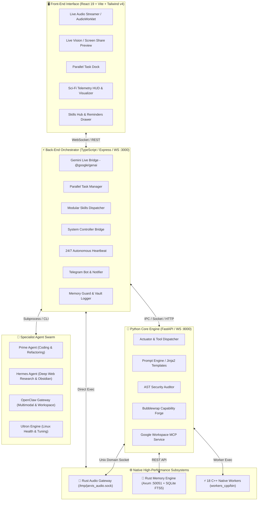

# 🤖 J.A.R.V.I.S. — Sovereign AI Operating System & Live Voice Assistant

[](https://ai.google.dev/)
[](https://www.typescriptlang.org/)
[](https://react.dev/)
[](https://www.python.org/)
[](https://www.rust-lang.org/)
[](https://isocpp.org/)
[](https://vitejs.dev/)
[](https://tailwindcss.com/)

**JARVIS-OS** (formerly Friday-OS) is an ultra-low latency, sovereign, multi-agent AI operating system and conversational assistant. It combines real-time full-duplex speech-to-speech AI, live multimodal vision, sub-millisecond C++ Linux hardware workers, high-performance Rust audio and memory engines, and autonomous specialist agent delegation into a seamless personal intelligence hub.

---

## 📑 Table of Contents

- [✨ Core Capabilities](#-core-capabilities)
- [🏛️ System Architecture](#️-system-architecture)
- [🧩 Specialist Multi-Agent Matrix](#-specialist-multi-agent-matrix)
- [📂 Project Structure](#-project-structure)
- [⚙️ Prerequisites](#️-prerequisites)
- [🚀 Quick Start & Installation](#-quick-start--installation)
- [🖥️ Running JARVIS-OS](#️-running-jarvis-os)
- [🛠️ Modular Skills & Native Tools Catalog](#️-modular-skills--native-tools-catalog)
- [🔒 Security, Privacy & Capability Forge](#-security-privacy--capability-forge)
- [📋 Configuration Reference (`.env`)](#-configuration-reference-env)
- [📱 Proactive Heartbeat & Telegram Sync](#-proactive-heartbeat--telegram-sync)

---

## ✨ Core Capabilities

- 🎙️ **Real-Time Speech-to-Speech (Gemini Live)**: Full-duplex conversational audio streaming (16kHz in / 24kHz out) with native barge-in/interruption support and zero awkward turn-taking pauses.
- 👁️ **Live Multimodal Vision**: Stream live webcam or screen capture directly into the Gemini Live session for visual problem solving, code reviews, and desktop guidance.
- ⚡ **Sub-Millisecond Linux Hardware Actuation (18 C++ Workers)**: Instant native execution for system telemetry, thermals, ALSA volume, display backlight, process management, Wi-Fi scanning, iptables/ufw auditing, and X11/Wayland window control.
- 🦀 **Rust Microsecond Audio & Universal Memory Gateways**:
  - `gateway_rust`: Zero-GC audio engine for headless direct microphone capture and speaker playback over Unix domain sockets (`/tmp/jarvis_audio.sock`).
  - `memory_engine`: Axum REST & WebSocket memory server (port 50051) with SQLite WAL, FTS5 full-text search, and knowledge graph traversal.
- 🤖 **Multi-Agent Specialist Delegation**: Asynchronously offload tasks to specialized autonomous agents:
  - **Prime Agent** (`prime-agent`): Software engineering, full-stack coding, refactoring, and AST analysis.
  - **Hermes Agent** (`hermes`): Deep web research, note synthesis, source grounding, and Obsidian vault indexing.
  - **OpenClaw Gateway** (`openclaw`): Multimodal gateway and sandboxed workspace tooling on port 18789.
  - **Ultron Engine** (`ultron`): Deep Linux kernel diagnostics, performance tuning, and sound server auto-healing.
- 🧠 **Sovereign Multi-Tier Memory Vault**: Local Markdown vault (`jarvis-memory/` (with `friday-memory/` compatibility alias)), timestamped conversation logs, daily agendas, and scoped department memory with anti-poisoning guards.
- 💓 **24/7 Autonomous Heartbeat**: Proactive background monitoring for battery drops, thermal spikes, overdue reminders, and task completions.
- 📱 **Mobile Telegram Control**: Full remote two-way assistant chat and command execution (`/status`, `/task`, `/remind`) directly from your phone.
- 🛡️ **Capability Forge & AST Auditor**: Sandboxed Bubblewrap (`bwrap`) environment to dynamically synthesize, test, and register custom Python tools on the fly.
- 📬 **Google Workspace MCP**: Native OAuth2 integration for Gmail, Google Calendar, and Google Tasks.
- 🎛️ **Cyberpunk Sci-Fi HUD Interface**: Real-time audio spectrum visualizer, thinking metrics (TTFT, round-trip latency), parallel task dock, and modular skills dashboard.

---

## 🏛️ System Architecture



---

## 🧩 Specialist Multi-Agent Matrix

| Agent | Platform / Engine | Role & Capabilities | Bridge File |
|---|---|---|---|
| **J.A.R.V.I.S. Prime** | Gemini 3.1 Live / 3.7 Flash | Master conversational voice orchestrator, real-time audio/vision comprehension, intent classifier, and task dispatcher. | `server.ts` / `core_engine/gemini_live.py` |
| **Prime Agent** | `prime-agent` CLI | Primary autonomous software engineer. Specializes in building applications, large refactors, code generation, and test-driven debugging. | `server/primeBridge.ts` |
| **Hermes Agent** | `hermes` CLI (v0.20+) | Deep autonomous web research, fact extraction, source grounding, and multi-turn Obsidian knowledge navigation. | `server/hermesBridge.ts` |
| **OpenClaw Gateway** | OpenClaw Gateway (:18789) | Multi-model agent gateway (Nemotron, Claude, MiniMax) with sandboxed workspace tooling and subagent sessions. | `server/openclawBridge.ts` |
| **Ultron Engine** | Native Ultron Daemon | Linux OS diagnostic audits, sound server auto-healing (PulseAudio/PipeWire), thermal monitoring, and memory cache pruning. | `server/ultronBridge.ts` |

---

## 📂 Project Structure

```
JARVIS-OS/
├── brain/                   # Python Core Intelligence Engine (FastAPI, Actuators, Security, MCP)
│   ├── actuator_dispatcher.py # Master tool execution & C++ worker dispatcher
│   ├── audio_bridge.py      # Unix domain socket bridge for low-latency PCM audio
│   ├── forge_sandbox.py     # Bubblewrap (bwrap) dynamic tool creation sandbox
│   ├── gemini_live.py       # Python Gemini Live SDK client
│   ├── google_mcp_service.py# Google Workspace MCP (Gmail, Calendar, Tasks OAuth2)
│   ├── main.py              # Python core engine entrypoint
│   ├── memory.py            # Local vault memory & session context miner
│   ├── prompt_engine.py     # Jinja2 template-based system prompt generator
│   ├── security.py          # Command sanitization and path traversal guard
│   ├── server.py            # FastAPI REST & WebSocket server (:8000)
│   ├── tool_ast_auditor.py  # Python AST security scanner for forged tools
│   ├── templates/           # Jinja2 system prompt templates (jarvis, hermes, etc.)
│   └── voice/               # FFT telemetry, VAD config, IPC tool sink
├── memory/                  # Unified Memory Subsystem
│   ├── vault/               # Sovereign Obsidian Markdown vault (Journal, Facts, Plans)
│   ├── engine/              # Rust universal memory & context engine (SQLite FTS5, tree, MCP)
│   └── python/              # Python memory drivers & bridges
├── gateway/                 # Communication & Hardware Gateways
│   ├── telegram/            # Python Telegram Channel Gateway bot
│   ├── audio_rust/          # Rust zero-GC microsecond audio gateway
│   └── services/            # Systemd service unit files & installers
├── server/                  # TypeScript server modules & agent bridges
│   ├── server.ts            # Express & WebSocket master backend (:3000)
│   ├── heartbeat.ts         # 24/7 background monitor for thermals, battery & tasks
│   ├── hermesBridge.ts      # Multi-turn Hermes CLI delegation bridge
│   ├── memoryGuard.ts       # Department memory scoping & write guardrails
│   ├── memoryLogger.ts      # Markdown dialogue and task execution logger
│   ├── openclawBridge.ts    # OpenClaw gateway client
│   ├── parallelTaskManager.ts # Multi-agent async task dock & status broadcaster
│   ├── primeBridge.ts       # Prime Agent autonomous coding bridge
│   ├── registry.ts          # Master agent & skill registry provider
│   ├── skills.ts            # Declarations and execution handlers for modular skills
│   ├── system_controller.ts # Linux system controller (volume, brightness, apps, etc.)
│   ├── telegramBot.ts       # Inbound Telegram polling bot for remote mobile control
│   └── telegramNotifier.ts  # Outbound Telegram notification dispatcher
├── ui/                      # User Interfaces
│   ├── web/                 # React 19 Front-End Application (Vite + Tailwind)
│   │   ├── src/             # Components, hooks, utils, App.tsx, CSS
│   │   ├── public/          # Audio worklets, icons, manifest
│   │   └── index.html       # Web app HTML entrypoint
│   └── hud/                 # Native PySide6 & HTML desktop HUD overlay
├── skills/                  # Actuators & Domain Skills
│   ├── omarchy/             # Hyprland desktop automation skills (C++ & Python)
│   └── native/              # 18 Native C++ Linux System Workers (workers_cpp)
├── tools/                   # Custom Tools & Automation Scripts
│   ├── custom/              # Dynamically synthesized custom tools (.py + .json)
│   └── scripts/             # Developer utilities & setup scripts
├── docs/                    # Architecture, Design & Documentation
├── agents.registry.json     # Ground-truth inventory of agents, skills, and tools
├── main.py                  # Root orchestrator launcher
├── package.json             # Node dependencies and build scripts
├── tsconfig.json            # TypeScript configuration
└── vite.config.ts           # Vite frontend configuration
```

---

## ⚙️ Prerequisites

Ensure your host system (Linux recommended: Ubuntu, Debian, Fedora, Arch) has the following tools installed:

| Requirement | Minimum Version | Notes |
|---|---|---|
| **Node.js** | `v18.0+` (v20+ recommended) | Supports `npm`, `pnpm`, or `bun` |
| **Python** | `3.11+` | With `venv` and `pip` |
| **Rust / Cargo** | `1.75+` (2021 edition) | Required to build `gateway_rust` and `memory_engine` |
| **C++ Compiler** | `g++` (C++17 support) | Required to build `workers_cpp` |
| **Audio Headers** | `libasound2-dev` / `libpulse-dev` | Required for native audio capture/playback |
| **Gemini API Key** | — | Obtain from [Google AI Studio](https://aistudio.google.com/) |

Optional tools for advanced features:
- `bubblewrap` (`bwrap`): For sandboxed dynamic tool execution.
- `xdotool`, `wmctrl`, `xbacklight`: For X11 desktop and brightness control.
- `ffmpeg`, `v4l-utils`: For camera and media controls.

---

## 🚀 Quick Start & Installation

### 1. Clone the Repository
```bash
git clone https://github.com/your-username/JARVIS-OS.git
cd Jarvis-OS
```

### 2. Configure Environment Variables
Copy `.env.example` to `.env` and fill in your API keys:
```bash
cp .env.example .env
```
Edit `.env` with your preferred editor:
```env
# Essential API Key
GEMINI_API_KEY="your_gemini_api_key_here"

# (Optional) Telegram Notifications & Remote Control
TELEGRAM_BOT_TOKEN="your_telegram_bot_token"
TELEGRAM_CHAT_ID="your_telegram_chat_id"

# (Optional) Google Workspace MCP OAuth2
GOOGLE_CLIENT_ID="your_google_client_id"
GOOGLE_CLIENT_SECRET="your_google_client_secret"

# (Optional) OpenClaw / Ultron Gateway
OPENCLAW_GATEWAY_HOST="127.0.0.1"
OPENCLAW_GATEWAY_PORT=18789
```

### 3. Install Node.js Dependencies
```bash
npm install
```

### 4. Set Up Python Virtual Environment
```bash
python3 -m venv .venv
source .venv/bin/activate
pip install -r core_engine/requirements.txt
```

### 5. Build Native C++ Workers & Rust Gateways
Compile the 18 C++ workers, the Rust audio gateway, and the Rust memory engine with a single command:
```bash
npm run build:native
```

*(Or compile individual subsystems as needed:)*
- **C++ Workers**: `npm run build:cpp`
- **Rust Memory Engine**: `npm run build:memory`
- **Rust Audio Gateway**: `npm run build:gateway`

### 6. (Optional) Setup Google Workspace MCP (OAuth2)
Authorize Gmail, Google Calendar, and Google Tasks access:
```bash
python3 scripts/google_auth_setup.py
```

---

## 🖥️ Running JARVIS-OS

JARVIS-OS can be run in several flexible modes depending on your workflow:

### Mode A: Full Web Experience (Voice + Multimodal Vision + Sci-Fi HUD)
Starts the TypeScript Express server, WebSocket bridge, and Vite frontend:
```bash
npm run dev
```
Open **`http://localhost:3000`** in Chrome / Chromium for full speech-to-speech, live screen share, and webcam vision.

#### Production Build & Run:
```bash
npm run build
npm start
```

---

### Mode B: Python Core Engine & Microsecond Audio Gateway
Starts the Python FastAPI engine, Jinja2 prompt system, and Actuator tool dispatcher:
```bash
npm run core
```

#### Standalone Headless Voice Mode (No Browser Needed):
Spawns the zero-GC Rust audio gateway listening to your native microphone and speakers via Unix Domain Sockets:
```bash
npm run core:standalone
```

---

### Mode C: Universal Rust Memory Engine (Standalone Service)
Runs the Axum SQLite FTS5 memory server on port `50051`:
```bash
# Initialize database tables
npm run memory:init

# Start memory server
npm run memory:serve
```

---

## 🛠️ Modular Skills & Native Tools Catalog

### 📦 Built-In Modular Skills (Function Calling)

All skills are registered in `agents.registry.json` and automatically declared to the Gemini Live session:

| Skill | Category | Description | Mode |
|---|---|---|---|
| `get_weather_forecast` | Weather | Live meteorological data, humidity, wind, and multi-day forecast via Open-Meteo. | Async |
| `get_news_headlines` | News | Real-time curated breaking news headlines across 7 categories via Google News RSS. | Async |
| `manage_reminders` | Productivity | Create, list, complete, or clear scheduled reminders monitored by the 24/7 heartbeat. | Sync |
| `calculate_or_convert` | Utility | Complex math evaluations, formula parsing, and physical unit conversions. | Sync |
| `get_personal_agenda` | Productivity | Today's prioritized schedule, due reminders, and active multi-agent workflows. | Sync |
| `manage_daily_schedule` | Productivity | Create, update, list, and complete daily schedule milestones and tasks. | Sync |
| `delegate_task` | Productivity | Universal smart delegation to the best suited agent (`prime-agent`, `hermes`, `ultron`). | Async |
| `delegate_to_prime_agent` | Productivity | Dispatches heavy coding, refactoring, and debugging tasks to Prime Agent. | Async |
| `delegate_to_hermes` | Productivity | Multi-turn autonomous web research, note taking, and source-grounded exploration. | Async |
| `delegate_to_openclaw` | Productivity | Dispatches multimodal workspace commands to the OpenClaw gateway (:18789). | Async |
| `delegate_to_ultron` | System | Triggers Linux OS health audits, performance tuning, and sound server healing. | Async |
| `get_system_info` | System | Ground-truth hardware metrics (CPU load %, RAM, disk space, battery, thermals). | Sync |
| `control_system` | System | Controls master volume, brightness, power management profiles, and screen locking. | Sync |
| `launch_application` | System | Launches desktop applications, terminals, IDEs, or media tools via XDG entries. | Sync |
| `manage_system_process` | System | Inspects top running processes by CPU/RAM, finds PIDs, and terminates runaway tasks. | Sync |
| `obsidian_search` | Productivity | Full-text search across Markdown notes, facts, and daily logs in `jarvis-memory/` (or legacy `friday-memory/`). | Sync |
| `obsidian_read` | Productivity | Reads full Markdown content and YAML frontmatter of any vault note. | Sync |
| `obsidian_create` | Productivity | Creates new Markdown notes with structured frontmatter in the user's vault. | Sync |
| `obsidian_append` | Productivity | Appends timestamped research logs and findings to existing vault notes. | Sync |

---

### ⚡ 18 High-Performance C++ Native Workers (`workers_cpp/bin/`)

Compiled natively to eliminate runtime interpreter overhead and provide sub-millisecond hardware access:

1. **`sys_telemetry`**: Instant CPU utilization %, memory breakdown, and Linux load averages.
2. **`thermal_scan`**: Direct `/sys/class/thermal` sensor inspection with temperature alerts.
3. **`hardware_ctrl`**: ALSA master volume, mute toggles, and display backlight controls.
4. **`pc_spec`**: Comprehensive hardware audit (CPU microarchitecture, GPU, motherboard, RAM slots).
5. **`process_ctrl`**: Top process monitor, memory leak detection, and signal dispatcher (`SIGTERM`/`SIGKILL`).
6. **`service_ctrl`**: Direct `systemd` daemon control (status, start, stop, restart, enable).
7. **`storage_scan`**: Mount points, filesystem health, disk space, and I/O utilization.
8. **`net_inspector`**: Active TCP/UDP socket connections, routing tables, and interface bandwidth.
9. **`wifi_scan`**: Linux wireless interface scanner, SSID discovery, and signal strength dBm.
10. **`firewall_audit`**: `iptables`, `nftables`, and `ufw` rule auditor and open port scanner.
11. **`desktop_control`**: X11/Wayland mouse movement, click simulation, keyboard strokes, and window focus.
12. **`desktop_ctrl`**: Ultra-fast desktop workspace switcher and window management.
13. **`file_search`**: Multi-threaded filesystem crawler with pattern filtering.
14. **`open_app`**: Fast application launcher using desktop XDG standard database.
15. **`media_ctrl`**: MPRIS D-Bus controller for Spotify, VLC, Chrome, and local media players.
16. **`memory_tester`**: High-throughput RAM cache bandwidth and latency stress benchmark.
17. **`vision_ctrl`**: Direct V4L2 camera device capture and video stream manager.
18. **`jarvis_sysctl`**: Low-level Linux kernel parameter tuner (`vm.swappiness`, TCP buffers, etc.).

---

## 🔒 Security, Privacy & Capability Forge

### 🛡️ Sovereign By Design
- **100% Local File & System Execution**: Sensitive data, conversation transcripts, personal schedules, and knowledge notes remain entirely on your local machine in `jarvis-memory/` (or legacy `friday-memory/`).
- **Memory Guardrails**: Department-scoped writes prevent cross-agent memory pollution or prompt injection poisoning.

### 🧪 Capability Forge (`core_engine/forge_sandbox.py`)
JARVIS can dynamically write and test its own custom Python tools in response to new user requirements:
1. **Dynamic Generation**: JARVIS writes `.py` code and a `.manifest.json` schema to `custom_tools/`.
2. **AST Security Audit (`tool_ast_auditor.py`)**: Checks for forbidden imports, dangerous system calls, network egress leaks, and path escapes.
3. **Bubblewrap Isolation (`bwrap`)**: Runs the tool in an unprivileged, isolated sandbox with read-only system mounts and isolated virtual environments (`.forge_venv`).
4. **Live Registration**: Upon passing verification, the tool is dynamically added to the Live agent's toolset without restarting the server.

---

## 📋 Configuration Reference (`.env`)

| Variable | Default | Description |
|---|---|---|
| `GEMINI_API_KEY` | *Required* | Google Gemini API key for Live audio, vision, and text models. |
| `PORT` | `3000` | Port for the Node.js / Express web server and UI. |
| `HERMES_BIN` | `hermes` | Path to Hermes CLI binary (searches `PATH` by default). |
| `HERMES_MAX_TURNS` | `12` | Maximum execution turns per Hermes research delegation. |
| `HERMES_TIMEOUT_MS` | `180000` | Hard timeout (3 mins) for Hermes delegations. |
| `PRIME_AGENT_BIN` | Auto-detected | Path to `prime-agent` executable. |
| `PRIME_TIMEOUT_MS` | `300000` | Hard timeout (5 mins) for Prime Agent coding tasks. |
| `OPENCLAW_GATEWAY_HOST` | `127.0.0.1` | Host address of OpenClaw gateway. |
| `OPENCLAW_GATEWAY_PORT` | `18789` | Port for OpenClaw gateway. |
| `TELEGRAM_BOT_TOKEN` | `""` | Telegram Bot API token from `@BotFather`. |
| `TELEGRAM_CHAT_ID` | `""` | Your Telegram numeric chat ID for receiving notifications. |
| `HEARTBEAT_INTERVAL_MS` | `300000` | Heartbeat pulse frequency in ms (5 minutes). |
| `BATTERY_LOW_THRESHOLD` | `15` | Battery percentage threshold for proactive Telegram warning. |
| `THERMAL_HIGH_THRESHOLD`| `85` | CPU temperature (°C) threshold for thermal throttling alert. |
| `OBSIDIAN_VAULT_PATH` | `./jarvis-memory` | Path to your personal sovereign Markdown memory vault. |

---

## 📱 Proactive Heartbeat & Telegram Sync

JARVIS-OS operates even when the browser is closed:

1. **Heartbeat Daemon (`server/heartbeat.ts`)**:
   - Runs on a configurable background timer (default: every 5 minutes).
   - Monitors upcoming and overdue reminders.
   - Polls hardware sensors via C++ workers for low battery (`< 15%`) and thermal spikes (`> 85°C`).
   - Dispatches instant alerts to your phone via Telegram.

2. **Bidirectional Telegram Bot (`server/telegramBot.ts`)**:
   - Long-polls for inbound commands from your mobile device.
   - Supported Commands:
     - `/status`: Instant snapshot of battery, CPU load, RAM usage, thermals, and active background agents.
     - `/task <prompt>`: Dispatches an asynchronous multi-agent task to Prime Agent or Hermes from mobile.
     - `/remind <time> <text>`: Schedules a reminder directly into the persistent reminder store.
     - Natural conversational messages: Chat with JARVIS on the go!

---

## 🤝 Contributing & License

Contributions, improvements, and custom skills are welcome! Please follow these guidelines:
1. Ensure all native C++ workers compile cleanly (`g++ -O3 -Wall -Wextra -std=c++17`).
2. Add corresponding test coverage or validation scripts before submitting pull requests.
3. Keep memory and state operations strictly local and secure.

---

<div align="center">
  <sub>Built with ❤️ for sovereign AI computing, real-time voice intelligence, and native Linux autonomy.</sub>
</div>
