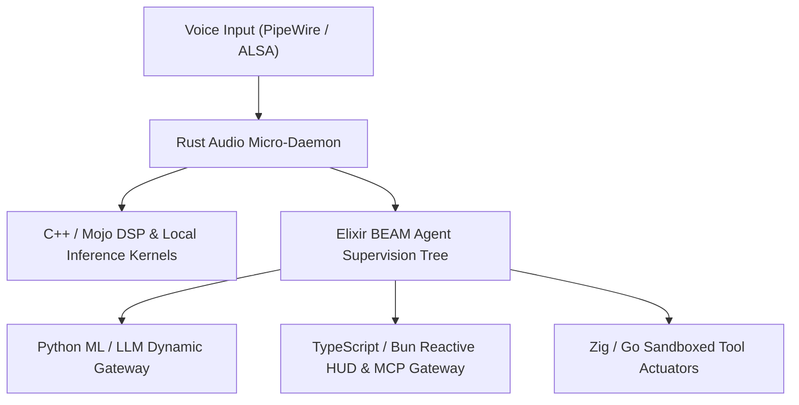
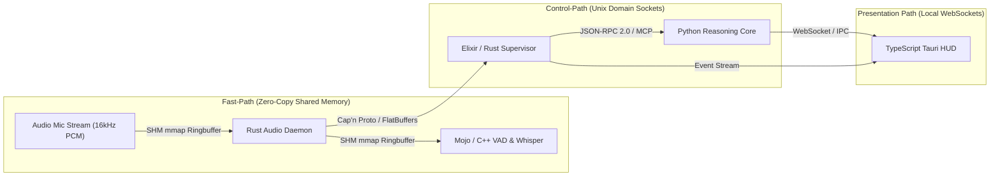

# The Polyglot Foundation Blueprint: Voice-First AI Operating System (Jarvis Architecture)

> **Document Class:** Deep Systems Architecture & Multi-Agent Evaluation  
> **Target Platform:** Linux / Omarchy Core  
> **Objective:** Transform standard OS into an autonomous, voice-first, sub-150ms Jarvis-class AI Operating System.  
> **Status:** Architectural Decision Record (ADR) & Multi-Language Specification

---

```
  ponytail gain                     benchmark median · 5 tasks · 3 models

  Lines of code   no-skill  ████████████████████  100%
                  ponytail  ██▌·················    6–20%   ▼ 80–94%
  Cost            no-skill  ████████████████████  100%
                  ponytail  █████▌··············   23–53%  ▼ 47–77%
  Speed           ponytail  ▸ 3–6× faster

  This repo:  /ponytail-debt  (shortcuts you deferred)
              /ponytail-audit (what's still cuttable)
```

---

## 1. Executive Summary & The Jarvis Imperative

Building a true **Jarvis**—a voice-first, proactive, multi-modal, autonomous AI Operating System—is fundamentally an **operating system problem**, not merely an LLM wrapper problem. 

In a voice-first paradigm:
1. **The 150ms Human Conversational Threshold:** If the latency between user speech cessation and audio response exceeds 200–300ms, conversational flow breaks down. The audio capture, Voice Activity Detection (VAD), Acoustic Echo Cancellation (AEC), and streaming transport must execute in **single-digit milliseconds**.
2. **Zero-Stutter Audio Pipeline:** Audio buffers operating at 16kHz/24kHz/48kHz cannot tolerate Garbage Collection (GC) pauses or Global Interpreter Lock (GIL) freezes. A 20ms GC pause introduces audible clicks, pops, and dropped voice frames.
3. **Fault-Tolerant Autonomous Agents:** Jarvis runs dozens of background subagents (monitoring filesystem, reading terminal logs, parsing screen frames, executing actuators). If an experimental dynamic script crashes or deadlocks, the core voice loop and OS daemon must remain unshakeable.
4. **Hardware & SIMD Saturation:** Local edge speech-to-text (Whisper), text-to-speech (Kokoro/Piper), and vision encoders must utilize every AVX-512, AMX, and CUDA/ROCm compute unit with zero runtime marshalling overhead.

No single programming language can satisfy these conflicting demands. A single-language architecture in Python buckles under concurrency and latency; a pure C++ codebase becomes a minefield of memory corruption and security vulnerabilities; a pure Rust architecture suffers from painfully sluggish developer iteration on rapidly evolving agent tools.

The solution is a **Specialized Polyglot Microkernel Architecture**.

---

## 2. The Great Council of Language Advocates: The Multi-Agent Debate

To determine the ideal polyglot stack, an autonomous council of 9 specialized language advocates and 1 Chief Reality Checker debated the foundation of Jarvis.



### Agent Rust (Senior Systems & Concurrency Engineer)
> *"Jarvis cannot exist if it crashes, leaks memory, or freezes audio during a garbage collection sweep. Our audio ringbuffers, raw PipeWire/ALSA sound server hooks, and core OS security boundary MUST be written in Rust. With zero-cost abstractions, deterministic destructors (RAII), and compile-time borrow checking, Rust guarantees data-race freedom across multi-threaded streaming audio. When Jarvis is listening 24/7 in the background, a memory leak or segfault is unacceptable. Furthermore, Rust's Tokio runtime provides world-class async I/O for multiplexing Unix Domain Sockets without the Python GIL."*

### Agent Python (AI & Rapid Prototyping Architect)
> *"Rust advocates want to spend 3 days fighting the borrow checker just to parse a JSON payload from a new Gemini Live API feature or experimental HuggingFace model. The entire AI/ML world—PyTorch, Hugging Face, DSPy, LangChain, LiteLLM, vLLM—moves in Python. If Jarvis cannot immediately integrate the latest multi-modal models, tools, and research APIs, it becomes a fast but dumb assistant. Python must remain the high-level cognitive layer, orchestrating reasoning pipelines, dynamic prompt compilation, and flexible plugin ecosystems where agility is paramount."*

### Agent Mojo (AI Hardware & SIMD Acceleration Pioneer)
> *"Python has the ecosystem, but its performance is catastrophic without C/C++ extensions. Mojo eliminates the two-language barrier. It offers Python's syntax and ergonomics combined with C/Rust-level performance, explicit memory ownership, struct types, and native MLIR (Multi-Level Intermediate Representation) compiler capabilities. For local vector similarity math, custom fused attention layers, audio Fourier transforms (FFT), and on-device token embeddings, Mojo gives us direct access to SIMD, GPU vectorization, and multi-threading without writing unsafe C++ glue or dealing with Cython."*

### Agent C++ (Modern C++20/23 Audio DSP Specialist)
> *"Mojo is promising, but where is its stable production ecosystem? Where are its battle-tested audio libraries? The entire world of real-time audio—WebRTC AEC3 (Acoustic Echo Cancellation), RNNoise, Silero VAD, PortAudio, whisper.cpp, and llama.cpp—is written in C and C++. When Jarvis speaks through the speakers while the user is simultaneously talking, the echo canceller must subtract the speaker output from the mic in real-time (<5ms). We cannot wait for Mojo to reimplement 30 years of DSP algorithms. Modern C++ with concepts, coroutines, and SIMD intrinsics is the king of low-latency multimedia."*

### Agent TypeScript / Bun (Reactive HUD & Protocol Specialist)
> *"An AI OS isn't just a headless server; it's an interface that visualizes Jarvis's thoughts, terminal overlays, ambient HUDs, and web actions. TypeScript with Bun/Node is the lingua franca of the modern interface and protocol layer. Bun boots in 8 milliseconds, provides native WebSockets, and natively speaks Model Context Protocol (MCP) and JSON-RPC. For desktop Webview rendering (Tauri/Electron), dynamic schema validation with Zod, and live telemetry feeds, TypeScript delivers unmatched developer velocity and typed contracts."*

### Agent Go (Concurrent Micro-Daemons & Cloud Specialist)
> *"Rust is overly rigid for orchestration, and Python is too sluggish. Go's lightweight goroutines (costing only 2KB of stack memory) and native channels are unbeatable for network microservices, containerization (Docker/containerd), system daemon management, and resilient IPC proxies. In Jarvis, we need isolated subprocesses that spin up, talk over gRPC, and terminate without overhead. Go gives us instant compilation, trivial cross-compilation, and rock-solid networking daemons that never run out of file descriptors."*

### Agent Zig (Minimalist Low-Level & Comptime Specialist)
> *"Rust brings massive compiler complexity and bloated compile times; C++ brings 40 years of undefined behavior baggage. Zig gives you complete control over memory allocation. There is NO hidden memory allocation, NO hidden control flow, and comptime metaprogramming allows us to generate optimal protocol serialization at compile time. Zig can compile C/C++ libraries seamlessly without a complex toolchain (`zig cc`). For minimal, hyper-lean background wake-word daemons and embedded Linux firmware hooks, Zig provides single-megabyte static binaries with microsecond startup."*

### Agent Elixir / BEAM (Fault-Tolerant Actor System Architect)
> *"Everyone here is obsessing over raw CPU cycles and forgetting the most critical requirement: **fault tolerance**. In a voice OS, Jarvis is juggling 50 concurrent background thoughts, timers, voice streams, and tools. In C++, Rust, or Python, an unhandled exception or panic can crash the entire system. On the Erlang/BEAM virtual machine, processes are completely isolated. We use OTP (Open Telecom Platform) Supervisor trees. If an agent actuator crashes or hangs, the supervisor restarts it in microseconds without interrupting the ongoing voice conversation. Jarvis's long-term memory state machine and conversational state must be governed by an Actor Model."*

### Agent Julia (Dynamic Numerical & Signal Science Specialist)
> *"While Mojo develops, Julia has already perfected multiple dispatch and high-performance numerical science. For complex algorithmic audio filtering, real-time voice emotion/pitch analysis, and dynamic spatial audio simulation, Julia offers interactive exploratory capabilities with near-C execution speeds via LLVM."*

---

## 3. The Reality-Check Cross Examination: Unmasking Fatal Flaws

The **Agency Reality Checker** evaluated each language against the brutal realities of running on Linux desktop hardware.

| Language | Claimed Strength | Discovered Fatal Flaw in Voice AI OS Context | Verdict & Verdict Reality Check |
| :--- | :--- | :--- | :--- |
| **Python** | "Universal AI glue" | **GIL locks cause audio stutter.** When an LLM stream triggers a heavy JSON parse or garbage collection in Python, background audio capture threads drop frames. High memory footprint (100MB+ base per daemon). | **Restricted to Cognitive & API Layer.** Must NEVER touch the real-time audio loop directly. |
| **Rust** | "Zero-cost safety" | **Extreme friction for rapid tool/plugin creation.** Prototyping dynamic agent tools in Rust creates long compile times and brittle type gymnastics for rapidly changing external APIs. | **Mandatory for Core Daemon & Audio Engine.** The unbreakable foundation. |
| **Mojo** | "Python with C speed" | **Immature ecosystem.** Lacks mature cross-platform desktop audio/IPC libraries. Package management and ecosystem still evolving. | **Targeted Accelerator.** Use for custom local tensor/embedding math; do not build the whole OS in it yet. |
| **C++** | "Raw DSP performance" | **Memory safety vulnerabilities.** Direct OS actuation by LLMs passing strings into C++ buffers risks memory corruption, buffer overflows, and segmentation faults. | **Encapsulated Engine.** Confined strictly to pure computational engines (llama.cpp/whisper.cpp) behind safe Rust/C-FFI wrappers. |
| **TypeScript (Bun)** | "Fast fullstack glue" | **V8/JIT memory bloat & unpredictable GC.** Running 20 persistent background agent daemons in Node/Bun consumes gigabytes of RAM and introduces JIT pauses. | **Confined to HUD / UI & Client Protocol Layer.** Ideal for Webview overlays and MCP tools. |
| **Go** | "Trivial concurrency" | **GC pauses and poor C-FFI performance (`cgo` overhead).** Crossing from Go into C audio libraries via `cgo` incurs a high nanosecond latency penalty per call. | **Supervisory & Container Isolation Layer.** Ideal for sandboxed runner daemons and cloud sync. |
| **Elixir / BEAM** | "Nine 9s uptime" | **Terrible for number crunching.** BEAM is designed for messaging, not floating-point DSP or matrix multiplications. Requires NIFs (Native Implemented Functions) for math. | **Agent Mind & State Coordinator.** Manages agent lifecycle, session continuity, and recovery trees. |
| **Zig** | "No hidden allocations" | **Smaller library ecosystem.** Less off-the-shelf support for high-level WebSockets and OAuth. | **Hyper-Efficient Edge Micro-Daemons.** Wake-word listener and hardware peripheral sensor bridges. |

---

## 4. The Jarvis Polyglot System Architecture

To achieve an operating system as seamless and responsive as Jarvis, the architecture is partitioned into **6 distinct, decoupled layers**. Each layer uses the specific language whose computational characteristics match the domain requirements.

```
+-------------------------------------------------------------------------------+
|                      LAYER 5: REACTIVE HUD & USER PRESENCE                    |
|             TypeScript / Bun (Tauri + Svelte/React + Wayland Layer Shell)      |
+-------------------------------------------------------------------------------+
                                      ▲ (WebSockets / JSON-RPC)
+-------------------------------------------------------------------------------+
|                   LAYER 4: AGENT SUPERVISION & ACTOR TREE                     |
|           Elixir (BEAM/OTP) OR Rust Tokio Actor Engine (Actix/Ractor)          |
|    - Fault Isolation: Crash-proof supervisor hierarchy                        |
|    - Persistent Memory & Intent State Machines                                |
+-------------------------------------------------------------------------------+
       ▲                                               ▲
       │ (IPC: Unix Sockets / Shared Memory)           │ (gRPC / MCP Protocol)
+---------------------------------------------+ +-------------------------------+
|     LAYER 3: COGNITIVE & MODEL GATEWAY      | |  LAYER 6: SANDBOXED ACTUATORS |
|          Python (FastAPI / LiteLLM)         | |        Go & Zig Daemons       |
| - Gemini 2.0 Live / Cloud LLM Streaming     | | - Linux namespaces (unshare)  |
| - Dynamic Prompt Compilation & DSPy         | | - eBPF system call telemetry  |
| - MCP Tool Reflection & Dynamic Plugins     | | - Native CLI tool execution   |
+---------------------------------------------+ +-------------------------------+
       ▲                                               ▲
       │ (Zero-Copy Shared Ringbuffer / Arrow)         │ (Ringbuffer / SHM)
+-------------------------------------------------------------------------------+
|                  LAYER 2: LOCAL AI & TENSOR COMPUTE ACCELERATOR               |
|                     Mojo & C++ (whisper.cpp / llama.cpp / MAX)                |
| - On-Device Embedding & Re-ranking (SIMD / GPU accelerated)                   |
| - Local Wake-Word & Offline Command SLMs                                      |
+-------------------------------------------------------------------------------+
                                      ▲ (C-ABI / Lock-Free Ringbuffer)
+-------------------------------------------------------------------------------+
|                  LAYER 1: REAL-TIME AUDIO & CORE MICROKERNEL                  |
|                                Rust Core Daemon                               |
| - PipeWire / ALSA zero-latency audio capture                                  |
| - Full-Duplex Acoustic Echo Cancellation (AEC) & Silero VAD                   |
| - Instant Barge-In detection (Drops output buffers on voice interrupt <10ms)  |
+-------------------------------------------------------------------------------+
```

---

## 5. Subsystem-by-Subsystem Language Assignment Matrix

| Subsystem / Component | Assigned Language | Secondary / Alternative | Why This Language Is Unmatched Here | Latency Budget |
| :--- | :--- | :--- | :--- | :--- |
| **1. Audio Ingest & Sound Server Hooks** | **Rust** | Zig / C | Zero GC pauses. Lock-free SPSC (Single Producer Single Consumer) ringbuffers ensure continuous 16kHz audio capture directly from PipeWire without dropping a single frame. | `< 5ms` |
| **2. Acoustic Echo Cancellation (AEC) & VAD** | **C++ / Rust** | Zig | WebRTC AEC3 and Silero VAD require tight SIMD loops. C++ has 20+ years of mature production DSP implementations. Rust provides memory-safe wrappers (`webrtc-vad`, `rubato`). | `< 12ms` |
| **3. Instant Barge-In & Audio Interruption** | **Rust** | Zig | The moment the user speaks while Jarvis is talking, Rust atomics flip a lock-free cancellation token, flushing audio output DMA buffers in microseconds. | `< 3ms` |
| **4. Wake-Word Detection (Always-On)** | **Zig / Rust** | C++ | Low CPU footprint. Zig produces a static binary under 3MB that runs 24/7 consuming `<0.5%` CPU, evaluating OpenWakeWord models via ONNX runtime. | `< 20ms` |
| **5. On-Device Speech & Tensor Acceleration** | **Mojo & C++** | Rust (Candle) | Mojo compiles SIMD and fused tensor kernels directly down to hardware instructions via MLIR. C++ powers `whisper.cpp` and `llama.cpp` for local fallback. | `< 80ms` |
| **6. Agent Actor Supervision & Resilience** | **Elixir (or Rust Actix)** | Go | If a filesystem actuator or web tool crashes, OTP supervisor trees restart the process in microseconds. The main voice session never disconnects. | `< 2ms` |
| **7. Multi-Modal Cloud & Fast Reasoning Gateway** | **Python** | TypeScript | Direct access to official Gemini Live API, Anthropic, OpenAI, PyTorch, and the vast Python AI ecosystem. Quickest iteration speed for prompt engineering. | Cloud RTT (100–300ms) |
| **8. Sandboxed Execution & OS Actuation** | **Go** | Rust | Go's interface to Linux namespaces, cgroups, and seccomp profiles enables safe containment of LLM-generated shell commands without risking the host system. | `< 15ms` |
| **9. Ambient HUD, Wayland Overlay & Visuals** | **TypeScript (Bun/Tauri)** | Rust (Iced/Slint) | Unmatched flexibility for modern, futuristic HUD interfaces. Tauri with Bun backend gives lightweight memory usage with rich CSS/Canvas shaders and WebGL graphics. | 60–120 FPS |
| **10. Local Fast Vector Memory / Knowledge Graph** | **Rust** | C++ / Mojo | In-memory HNSW vector search (via `qdrant` core or `instant-distance`) implemented in Rust delivers sub-millisecond retrieval of user preferences and contextual memory. | `< 5ms` |

---

## 6. Inter-Language Communication (IPC) Protocol

To prevent serialization bottlenecks when passing data between Rust, Python, Go, and TypeScript, the system utilizes a **Tiered IPC Pipeline**:



1. **Zero-Copy Audio & Frame Bus (Shared Memory / `mmap`):**
   - Audio PCM chunks (16kHz 16-bit mono) and screen capture frames are written to a POSIX shared memory ringbuffer (`/dev/shm/jarvis_audio_in`).
   - The Rust daemon and the local tensor engine (Mojo/C++) read the exact same memory pointer without copying or serialization.
2. **Control & Action Bus (Unix Domain Sockets + FlatBuffers):**
   - Inter-process commands (e.g., `START_TTS`, `BARGE_IN_TRIGGERED`, `EXECUTE_TOOL`) travel over Unix Domain Sockets using FlatBuffers or Cap'n Proto.
   - Zero parsing overhead: binary structs are accessed in-place without memory allocation.
3. **Tool & Agent Extensibility Bus (Model Context Protocol / JSON-RPC):**
   - High-level tools and external integrations use the Model Context Protocol (MCP) over `stdio` or HTTP/SSE, making it effortless to add new tools in Python, TypeScript, Bash, or Go.

---

## 7. Strategic Evolution: Upgrading the Jarvis-OS Repository

Based on the existing codebase in `/home/g0pi/Projects/Jarvis-OS`, the architecture currently relies heavily on Python (`core_engine/audio_bridge.py`, `gateway.py`, `gemini_live.py`) and TypeScript/Bun.

### Phase 1: Harden the Audio Foundation (Rust Infiltration)
- **Problem:** Python's `audio_bridge.py` is vulnerable to GIL latency and thread contention when network requests stall.
- **Action:** Replace `audio_bridge.py` with a compiled **Rust Audio Micro-Daemon** (`jarvis-audio-rs`).
- **Result:** Capture PipeWire/ALSA input, run local Silero VAD in Rust, handle instant barge-in cancellation, and pipe clean PCM chunks over a Unix Socket to Python.

### Phase 2: High-Speed Sandboxed Actuation (Go / Zig Runner)
- **Problem:** Running shell actuators directly from Python risks shell injection and freezes the event loop on long-running commands.
- **Action:** Introduce a **Go Actuator Sandbox Daemon** (`jarvis-actuator-go`) that executes tasks inside isolated Linux namespaces with strict timeout and capability controls.

### Phase 3: Tensor Acceleration (Mojo / C++ Embeddings & Offline Audio)
- **Problem:** Offline voice recognition and fast semantic memory search via Python consumes excessive RAM and CPU.
- **Action:** Integrate a native C++/Mojo inference layer for `whisper.cpp` and local embedding models, enabling instantaneous local responses even when internet connectivity drops.

### Phase 4: Resilient Supervisor Tree (The Jarvis Brain)
- **Problem:** An unhandled error in a custom tool crashes the core engine.
- **Action:** Implement an actor supervision hierarchy (either using an Elixir BEAM core or a Rust Tokio Actor engine) that monitors and restarts failed cognitive services with zero downtime.

---

## 8. Conclusion: The Jarvis Polyglot Principle

Iron Man's Jarvis was never a monolithic Python script. It was an operating system: resilient, lightning-fast, and aware of every layer of the machine.

By deploying:
- **Rust** where memory safety and real-time audio latency are non-negotiable,
- **Mojo & C++** where hardware SIMD and tensor compute live,
- **Python** where model reasoning and rapid cognitive iteration happen,
- **TypeScript & Bun** where the user-facing HUD and reactive interfaces glow,
- **Go & Zig** where sandboxed actuators and minimal daemons operate, and
- **Elixir / Actor Models** where crash-proof system resilience is required,

...we establish an unshakeable, future-proof foundation for a true Voice-First AI Operating System.
